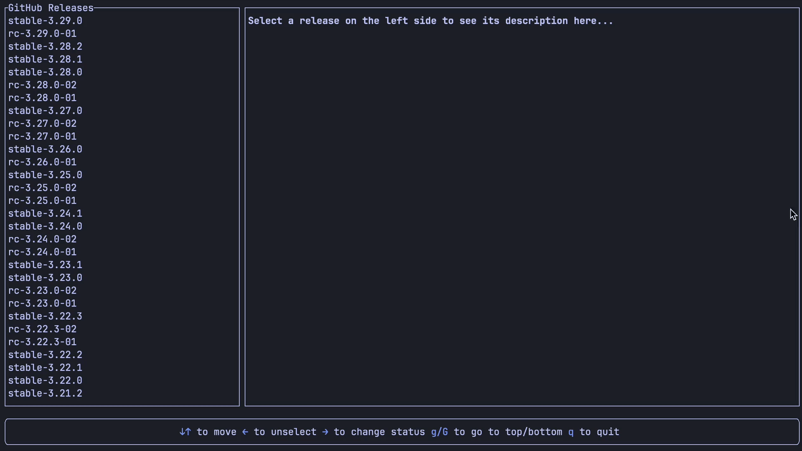

# Releases browser

Browse github releases for a specific repository and install its APK asset to a connected android device.

Before the app can be used, those environment vars need to be set:
- $GH_ACCESS_TOKEN
- $GH_OWNER
- $GH_REPO

This TUI Application uses:
- [Ratatui](https://ratatui.rs/)
- [Github API](https://docs.github.com/en/rest)
- [adb_client crate](https://crates.io/crates/adb_client) to communicate with android

